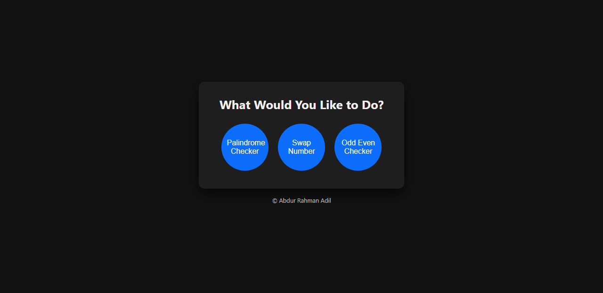
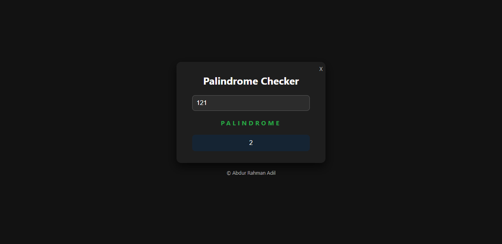
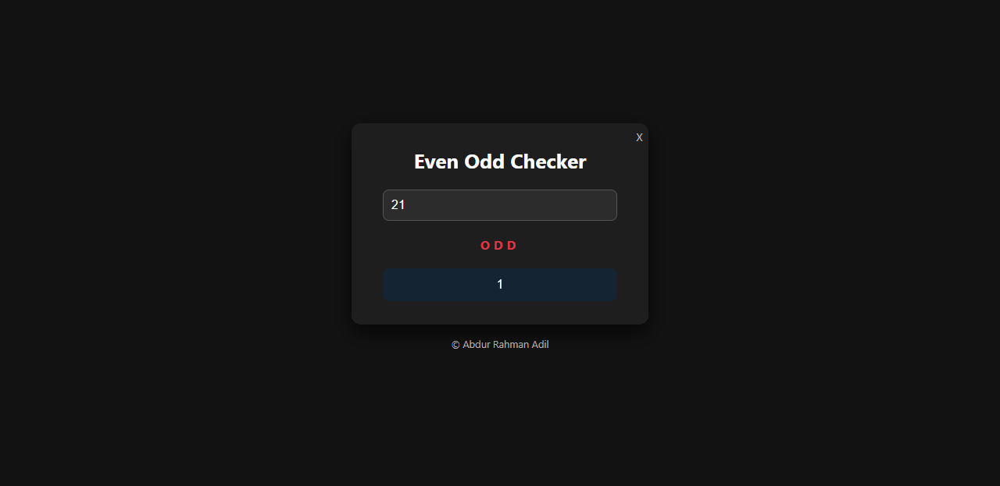

# Multi-Utility Checker

A sleek, modern web application that provides three essential utilities: Palindrome Checker, Number Swapper, and Odd/Even Checker. Built with vanilla JavaScript and featuring a dark theme with smooth animations.

## 🌟 Features

### 1. **Palindrome Checker**
- Check if any text or number is a palindrome
- Real-time validation with visual feedback
- Supports both numbers and text strings

### 2. **Number Swapper**
- Swap two numbers with visual animation
- Color-coded inputs for better visualization
- Automatic reset after operation

### 3. **Odd/Even Checker**
- Instantly determine if a number is odd or even
- Clean, intuitive interface
- Clear visual indicators

## 🎨 Design Highlights

- **Dark Mode UI**: Easy on the eyes with a modern dark theme
- **Smooth Animations**: Enhanced user experience with transitions and hover effects
- **Responsive Design**: Works seamlessly across different screen sizes
- **Visual Feedback**: Color-coded results (green for success, red for alerts)
- **Error Handling**: Input validation with shake animation for empty fields

## 🚀 Getting Started

### Prerequisites
- A modern web browser (Chrome, Firefox, Safari, or Edge)
- No additional dependencies required!

### Installation

1. Clone the repository:
```bash
git clone https://github.com/yourusername/multi-utility-checker.git
```

2. Navigate to the project directory:
```bash
cd multi-utility-checker
```

3. Open `index.html` in your browser:
```bash
# On macOS
open index.html

# On Windows
start index.html

# On Linux
xdg-open index.html
```

Or simply double-click the `index.html` file.

## 📁 Project Structure

```
multi-utility-checker/
│
├── index.html          # Main HTML structure
├── style.css           # Styling and animations
├── main.js             # JavaScript functionality
└── README.md           # Project documentation
```

## 🎯 Usage

### Palindrome Checker
1. Click on "Palindrome Checker" from the main menu
2. Enter any text or number
3. Click "Check Palindrome"
4. View the result (Palindrome or Not Palindrome)

### Number Swapper
1. Click on "Swap Number" from the main menu
2. Enter two numbers in the input fields
3. Click "Swap"
4. Watch as the numbers exchange positions with color animation

### Odd/Even Checker
1. Click on "Odd Even Checker" from the main menu
2. Enter any number
3. Click "Check Now"
4. See if your number is odd or even

## 🛠️ Technologies Used

- **HTML5** - Structure and semantic markup
- **CSS3** - Styling, animations, and responsive design
- **JavaScript (ES6+)** - Logic and interactivity

## ✨ Key Features

- **No Dependencies**: Pure vanilla JavaScript - no frameworks needed
- **Auto-Reset**: Forms automatically reset after 4 seconds
- **Countdown Timer**: Visual countdown on buttons after submission
- **Input Validation**: Prevents empty submissions with error feedback
- **Disabled State**: Prevents multiple submissions during processing

## 🎨 Color Scheme

- Background: `#121212`
- Container: `#1e1e1e`
- Primary Blue: `#0d6efd`
- Success Green: `#28a745`
- Alert Red: `#dc3545`
- Input Background: `#2c2c2c`

## 📸 Screenshots

### Main Menu


### Palindrome Checker


### Number Swapper


### Odd/Even Checker



## 🤝 Contributing

Contributions are welcome! Feel free to:

1. Fork the project
2. Create your feature branch (`git checkout -b feature/AmazingFeature`)
3. Commit your changes (`git commit -m 'Add some AmazingFeature'`)
4. Push to the branch (`git push origin feature/AmazingFeature`)
5. Open a Pull Request

## 📝 License

This project is open source and available under the [MIT License](LICENSE).

## 👨‍💻 Author

**Abdur Rahman Adil**

- GitHub: [@yourusername](https://github.com/SyntaxAdil)
- Email: abdurrahmanadil005@gmail.com

## 🙏 Acknowledgments

- Inspired by the need for simple, elegant utility tools
- Built with ❤️ using vanilla JavaScript

---

⭐ If you found this project helpful, please consider giving it a star!